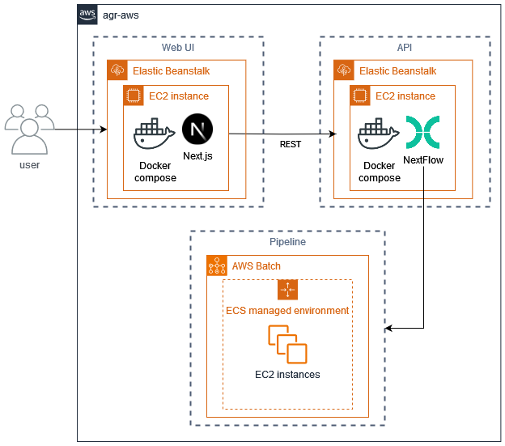

# AGR PAVI
AGR's Proteins Annotations and Variants Inspector

## Tabel of content
 * [Architecture](#architecture)
 * [Development principles and guidelines](#development-principles-and-guidelines)
    * [Development environment setup](#development-environment-setup)
       * [IDE](#ide)
       * [Execution environment](#execution-environment)
    * [Dependency management](#dependency-management)
       * [Dependency and version specifications](#dependency-and-version-specifications)
       * [Dependency updates](#dependency-updates)
       * [Installing dependencies](#installing-dependencies)
    * [Python components](#python-components)
       * [Code documentation (docstrings)](#code-documentation-docstrings)
       * [Virtual environment](#virtual-environments)
       * [Dependency management](#dependency-management-1)
       * [Typing](#typing)
       * [Styling](#styling)
       * [Unit and integration testing](#unit--integration-testing)
    * [Javascript components](#javascript-components)
       * [Virtual environment](#local-dependencies)
       * [Dependency management](#dependency-management-2)
       * [Typing](#typing-1)
       * [Styling](#styling-1)
       * [Unit and integration testing](#unit--integration-testing-1)
    * [AWS resource definitions (aws_infra)](#aws-resource-definitions-aws_infra)
       * [Shared AWS CDK code](#shared-aws-cdk-code)
       * [CDK CLI](#cdk-cli)
       * [Important files](#important-files)
       * [Validation](#Validation)
       * [Deployment](#deployment)
 * [Acknowledgements](#acknowledgements)
 * [Maintainers](#maintainers)


## Architecture
The PAVI repository is a monorepository consisting of all components that make PAVI work,
while each components is deployed and scaled independently for better isolation of concerns
and to ensure sufficient availability and performance without needing to oversize to handle multiple
components concurrently.

PAVI is made up of the following components:
 * A [Web UI](webui/) that enables (end-)user interaction
 * An [API](api/) that connects the web UI to the processing pipeline,
   and serves as job-manager for following up on processing and result retrieval
 * [pipeline](pipeline/) components that comprise the processing pipeline
   required to display the requested proteins, annotations and variants.  
   This forms the heart of PAVI, doing all sequence retrieval, processing, alignments etc.

Each of these components has its required AWS resources defined as code
through AWS CDK, in a `aws_infra` subdirectory.



## Development principles and guidelines
This project is divided in subcomponents which function independently but share similar concepts in their setup.
All components have a `Makefile` in their subdirectory that contains all targets for code validation, dependency management,
build and deployment. Below subchapters describe common concepts and make targets used for specific groups of subcomponents.

### Development environment setup
#### IDE
Any IDE or text editor can be used to develop the PAVI code, but this repository contains a few VS Code configuration files
to simplify getting started developing using VS Code.

To open a workspace containing all components contained in this repository:
```bash
code agr-pavi-monorepo.code-workspace
```

The following VS code extension are recommended to be installed in this workspace:
 * [bash IDE](https://marketplace.visualstudio.com/items?itemName=mads-hartmann.bash-ide-vscode)
 * [Docker](https://marketplace.visualstudio.com/items?itemName=ms-azuretools.vscode-docker)
 * [ESLint](https://marketplace.visualstudio.com/items?itemName=dbaeumer.vscode-eslint)
 * [Flake8](https://marketplace.visualstudio.com/items?itemName=ms-python.flake8)
 * [Makefile Tools](https://marketplace.visualstudio.com/items?itemName=ms-vscode.makefile-tools)
 * [Github Actions](https://marketplace.visualstudio.com/items?itemName=GitHub.vscode-github-actions)
 * [MyPy type checker](https://marketplace.visualstudio.com/items?itemName=ms-python.mypy-type-checker)
 * [Nextflow](https://marketplace.visualstudio.com/items?itemName=nextflow.nextflow)

#### Execution environment
Execution of the PAVI code through the several make targets requires the following dependencies.
Install instructions assume execution in Ubuntu 24.04:
 * Docker: see the apt installation instructions on the [docker website](https://docs.docker.com/engine/install/ubuntu/#install-using-the-repository)
 * Make: `apt install make`
 * Python 3.12 (default distribution on Ubuntu 24.04)
 * python 3 venv: `apt install python3.12-venv`
 * Java (NextFlow runtime requirement): see adoptium [temurin docs](https://adoptium.net/en-GB/installation/linux/#_deb_installation_on_debian_or_ubuntu) (install v21)
 * Node Version Manager (NVM):
    * prerequisites: `apt install build-essential libssl-dev`
    * NVM installation: see the [nvm docs](https://github.com/nvm-sh/nvm?tab=readme-ov-file#installing-and-updating).
 * Cypress [linux prerequisites](https://docs.cypress.io/app/get-started/install-cypress#Linux-Prerequisites).

### Dependency management
#### Dependency and version specifications
Application dependencies are defined either the `pyproject.toml` file for python dependencies,
or the `package.json` file for node.js dependencies.

Furthermore, version specifications should use wildcards or version specifiers such as the compatible
release clause (`~=` in python, `~` in node.js) to allow for automatic upgrades to newer patch and optionally
minor versions which are expected not to cause any breakage while improving security and stability.
A lock file must be used to freeze all dependencies to specific versions, and this lock file must be
committed to the repository, so that builds and runs on different environments all result in the same
product, and dependency updates can always be validated before being applied to production environments.

#### Dependency updates
Flexible dependency version specifications as defined above allow for a separation between low-risk version upgrades,
which are expected to pass all validations without requiring additional changes, and more high-risk version upgrades,
which are more likely to require code changes to make the code work with the upgraded dependency.

To update the dependency lock files to apply the latest available low-risk dependency version upgrades:
```bash
# To update all dependency lock files (within a subcomponent)
make update-deps-locks-all
```

For high-risk upgrades, update the version specified in the `pyproject.toml` and/or the `package.json` file,
then run the above make target to update the lock file(s).
Run all tests to validate the code still works and update as required if not.

Low-risk updates are automatically applied on PR validation to all pull requests requesting to merge into the `main` branch,
unless the `no-deps-lock-updates` label is added to the PR.
High-risk upgrades are proposed regularly by dependabot by means of PRs with version update proposals,
as configured in the [`dependabot.yml`](/.github/dependabot.yml) file.
See the [Github Docs](https://docs.github.com/en/code-security/dependabot/dependabot-version-updates/configuring-dependabot-version-updates) for more details on the specifications for the dependabot configuration file.

#### Installing dependencies
To install all component dependencies (frozen versions defined in the lock file):
```bash
# To install application dependencies only
make install-deps
# To install application and test dependencies
make install-test-deps
# To install all dependencies
make install-deps-all
```

### Python components
In addition to the general development principles and concepts described above,
PAVI components using python use the following python-specific general concepts.
#### Virtual environments
All python components use virtual environments to isolate the build- and application dependencies from the global system python setup.
Make targets to create these virtual environments can be found in the [PAVI root Makefile](/Makefile). However, these do not need to be
created manually, as they are automatically created as and when appropriate (when calling Make targets requiring them).
 * The `.venv/` directory is used as virtual environment for application dependencies.
 * The `.venv-build/` directory is used as virtual environment for dependency management requirements
   such as pip-tools, which are installed independently of the application dependencies.

Make targets depending on these virtual environments will and should use the binaries and libraries
installed in these virtual environment, without requiring them to be activated.

The virtual environment can be activated environment-wide by calling below command,
should this be needed for development or troubleshooting purpose (VSCode will active
the application `.venv` automatically when opening a new terminal for that directory.
```bash
source .venv/bin/activate
```

Once the virtual environment is activated, all python command will now automatically use
the python binaries and dependencies installed in this isolated virtual environment.

To deactivate an active virtual environment run the `deactivate` command.

#### Dependency management
##### Dependency and version specifications
Application dependencies are defined in the `pyproject.toml` file and should follow the [python guidelines](https://packaging.python.org/en/latest/guides/writing-pyproject-toml/#dependencies-and-requirements).
This is required to ensure compatibility with external dependency managers such as dependabot.

At time of writing, dependency specifications used by poetry 1.* do not adhere to the python guidelines
(specifically, its `pyproject.toml` file usage is not PEP-621 compatible), which makes it incompatible
with dependabot (which can only update the `poetry.lock` file but not the dependency versions specified
in the `pyproject.toml` file as a consequence). Due to this, the decision was made not to use poetry,
at least until it becomes PEP-621 compatible (which is expected to be from the poetry 2.* release).

As an alternative, all PAVI python components currently use `pip-tools` for dependency management.
This is done by converting the flexible dependency specifiers from the `pyproject.toml` file to
frozen versions in `requirements.txt` files. As a consequence, dependabot can not distinguish project
dependencies from subdependencies (something that is possible through poetry) and will propose updates
for subdependencies where that may not be appropriate. Such subdependencies must be added to the relevant
`ignore:` sections in the [dependabot.yml](/.github/dependabot.yml) configuration file to disable such update proposals.

#### Code documentation (docstrings)
All modules, functions, classes and methods should have their input, attributes and output documented
through docstrings to make the code easy to read and understand for anyone reading it.
To ensure this is done in a uniform way accross all code, follow the [Google Python Style Guide on docstrings](https://google.github.io/styleguide/pyguide.html#38-comments-and-docstrings).

#### Typing
**TL;DR**  
Use Python type hints wherever possible, `mypy` is used to enforce this on PR validation.  
To check all code typing in a PAVI submodule, run:
```shell
make run-type-checks
```

**Detailed explanation**  
While Python uses dynamic typic at runtime, it is recommended to use type hints
to declare intended types. These can be used by IDEs and type checkers to provide code completion,
usage hints and warning where incompatible types are used.
This provides a way to catch more potential bugs during development, before they arise in deployed
environments and require tedious troubleshooting.

As an example, the following untyped python function will define local cache usage behavior taking a boolean as toggle:
```python
def set_local_cache_reuse(reuse):
    """
    Define whether or not data_file_mover will reuse files in local cache where already available pre-execution.

    Args:
        reuse (bool): set to `True` to enable local cache reuse behavior (default `False`)
    """
    global _reuse_local_cache
    _reuse_local_cache = reuse
    if reuse:
        print("Local cache reuse enabled.")
    else:
        print("Local cache reuse disabled.")
```

When called with boolean values, this function works just fine:
```python
>>> set_local_cache_reuse(True)
Local cache reuse enabled.
>>> set_local_cache_reuse(False)
Local cache reuse disabled.
```
However when calling with a String instead of a boolean, you may get unexpected behaviour:
```python
>>> set_local_cache_reuse("False")
Local cache reuse enabled.
```
This happens because Python dynamically types and converts types at runtime,
and all strings except empty ones are converted to boolean value `True`.

To prevent this, add type hints to your code:
```python
def set_local_cache_reuse(reuse: bool) -> None:
    """
    Define whether or not data_file_mover will reuse files in local cache where already available pre-execution.

    Args:
        reuse (bool): set to `True` to enable local cache reuse behavior (default `False`)
    """
    global _reuse_local_cache
    _reuse_local_cache = reuse
    if reuse:
        print("Local cache reuse enabled.")
    else:
        print("Local cache reuse disabled.")
set_local_cache_reuse("False")
```

Type hints themselves are not enforced at runtime, and will thus not stop the code from running (incorrectly),
but using `myPy` those errors can be revealed before merging this code. Storing the above code snippet in a file
called `set_local_cache_reuse.py` and running `myPy` on it gives the following result:
```shell
> mypy set_local_cache_reuse.py
set_local_cache_reuse.py:9: error: Name "_reuse_local_cache" is not defined  [name-defined]
set_local_cache_reuse.py:14: error: Argument 1 to "set_local_cache_reuse" has incompatible type "str"; expected "bool"  [arg-type]
Found 2 errors in 1 file (checked 1 source file)
```
With the myPy output, we can now return to the code and fix the errors reported
which would otherwise result in silent unexpected behavior and bugs.

To prevent these sort of unexpected bugs, all PAVI subcomponents must use type hints wherever possible.
`mypy` is used a type checker, and is run on all python subcomponents on every PR validation
to ensure code of good quality.

To run type checks:
```bash
make run-type-checks
```

#### Styling
To ensure consistent code styling is used accross components, `flake8` is used as linter in all python components.
These style checks are enforced through PR validation, where they need to pass before enabling PR merge.

To run style checks:
```bash
make run-style-checks
```

#### Unit & integration testing
Unit and integration testing for python components is done through [Pytest](https://pytest.org/),
and all unit and integration tests must pass before PRs can be approved and merged.
A minimum of 80% code coverage is required to ensure new code gets approriate unit
testing before getting merged, which ensures the code is functional and won't break
unnoticed in future development iterations.

To run unit testing as a developer (generating an inspectable HTML report):
```bash
make run-unit-tests-dev
```

### Javascript components
#### Local dependencies
By default, `npm` (the default Node.js Package Manager) downloads dependencies into a local `node_modules` subdirectory,
and we make us of this feature to isolation dependencies independently for each of the PAVI components.

#### Dependency management
##### Dependency and version specifications
Dependency management for node depencies is done using `npm`.
Application dependencies are defined in the `package.json` file (with flexible version specifications),
and frozen in the `package-lock.json` file.

#### Typing
As Javascript uses dynamic typic at runtime and does not support native type hints,
[TypeScript](https://www.typescriptlang.org/) is used instead as development language,
which is transpiled to javascript on build and deployment.
Using Typescript over plain Javascript adds support for code-completion, usage hints and
warnings on usage of incompatible types by IDEs and type checkers, providing a way to
catch more potential bugs during development, before they arise in deployed environments
and require tedious troubleshooting.
Therefor, all PAVI subcomponents requiring javascript code should use Typescript.
The typescript compiler `tsc` is used a type checker, and is run on all Typescript subcomponents
on every PR, to ensure code of good quality.

As Typescript is uses Javascript code with additional syntax for types,
this Typescript code is easy to read and write by any Javascript developer.

To run type checks:
```bash
make run-type-checks
```

#### Styling
To ensure consistent code styling is used accross components, `eslint` is used as linter in all javascript/typescript components.
These style checks are enforced through PR validation, where they need to pass before enabling PR merge.

To run style checks:
```bash
make run-style-checks
```

#### Unit & integration testing
Unit and integration testing for javascript/react components is done through `jest`,
and all unit and integration tests must pass before PRs can be approved and merged.

To run unit testing as a developer:
```bash
make run-unit-tests
```

### AWS resource definitions (aws_infra)
All PAVI components are deployed to AWS, and deployment of those components usually depends on certain AWS resources
such as ECR registries to upload the container images to, Elastic Beanstalk Applications to deploy the application services to
or AWS Batch and ECS to execute pipeline jobs.
All these AWS resources are defined as code through [AWS CDK](https://docs.aws.amazon.com/cdk/v2/guide/getting_started.html),
which can be found in the `aws_infra` subdirectory of the respective components' directory.

AWS CDK is an open-source framework that enables writing
the entire cloud application as code, including all event sources and other AWS resources
which are require to make the application executable in AWS in addition to the application code.
This allows for an easy and reproducible deployment, that can be fully defined, versioned and documented as code.

To allow better interoperability and code sharing, all AWS CDK code in PAVI is written in Python,
independent of the language used for the component it serves.

#### Shared AWS CDK code
All PAVI AWS CDK code depends on the `pavi_shared_aws` python package (found in the [/shared_aws/py_package/](/shared_aws/py_package/) directory),
which holds all AWS CDK code and classes shared accross multiple components.

Before running or making change to any of the CDK code for PAVI submodules in the `aws_infra` directories,
build and install the `pavi_shared_aws` package by following the [build-and-install](../../shared_aws/py_package/README.md#build-and-install) instructions in the according README.

While shared AWS CDK code is stored in the `pavi_shared_aws` package, shared AWS resource which
are managed by PAVI but used by multiple components (such as the AWS Chatbot configuration)
are defined in the [/shared_aws/aws_infra/](/shared_aws/aws_infra/) directory,
which holds the AWS CDK definitions for those AWS resources.

#### CDK CLI
While the CDK code is written in Python, the CDK CLI which is used for validation and deployment
of the AWS resources defined is installed through `npm`, and has its version defined and frozen
in the `package.json` and the `package-lock.json` files respectively.

To install the CDK CLI used for any component, execute:
```shell
make install-cdk-cli
```

This will install the CDK CLI in a [local node dependencies directory](#local-dependencies),
which means the CLI is not installed globally but instead can be executed through `npx cdk`.
Before calling the CDK CLI on any of the CDK python code, ensure the relevant virtual environment,
in which the CDK app dependencies are installed, is activated.

All CDK CLI installations in this repository are installed and tested using the same
node.js version used for the web UI, v20 at time of writing.

Here's a list of the most useful CDK CLI commands. For a full list, call `cdk help`.
 * `npx cdk ls`          list all stacks in the app
 * `npx cdk synth`       emits the synthesized CloudFormation template
 * `npx cdk deploy`      deploy this stack to AWS
 * `npx cdk diff`        compare deployed stack with current state
 * `npx cdk docs`        open CDK documentation

#### Important files
Two standard CDK configuration files can be found at the root level of each `aws_infra` directory:
 * `cdk.json`
    Contains the main CDK execution configuration parameters
 * `cdk.context.json`
    Contains the VPC context in which to deploy the CDK Stack.

Then the AWS Stack to be deployed using CDK is generally defined in the following files and directories:
 * `cdk_app.py`
    The root level CDK application, defining the entire AWS Stack to be deployed (possibly in multiple copies for multiple environments).
 * `cdk_classes/`
    Python sub-classes defining the parts of the CDK stack (which represents a single CloudFormation stack)
    and all individual CDK constructs, representing individual cloud components.

All CDK-defined AWS resource defininitions are validated on every PR, and automatically deployed on merge to main.

#### Validation
When making changes to any of the CDK files, validate them before requesting a PR
or attempting a deployment.

**Note**: as part of the validation requires comparison to deployed resources,
you need to be authenticateable to AWS before you can run below validation target.

To validate the CDK code run the following command:
```bash
make validate-all
```
This make target will run two things:

1. First it will run the unit tests (through the Makefile's `run-unit-tests` target),
   which test CDK code for resource definitions exepected by other parts of this repository,
   to ensure updates to the CDK code don't accidentally remove or rename essential AWS resources.

2. After the unit tests pass, it will run `cdk diff` on the production stack,
   which compares the production stack defined in the code to the deployed stack
   and displays the changes that would get deployed. 
   Inspect these changes to ensure the code changes made will have the expected effect
   on the deployed AWS resources.
   As `cdk diff` will synthesize the full (Cloudformation) stack to do so, it will
   produce errors when errors are present in any of the CDK code (where those
   errors would not have been caught by the unit tests).

If the validation reports any errors, inspect them and correct the code accordingly.

This validation step allows the developer to fix any errors before deployment,
reducing the amount of troubleshooting and fixing that would otherwise be required
on failing or incorrect deployments.

**Note**:  
While some of the existing CDK code references external resource in AWS
(outside of the CDK stack defined in the subdirectory in case),
unit testing does not actually query those resources.
As a result, unit testing will not catch changes to or errors in those (external) resource definitions.  
Only `cdk diff` will query actual AWS resources and produce errors accordingly
if there would be any issues with such externally defined resources.
Consequently, the `cdk diff` step in the `validate-all` make target requires AWS authentication.

#### Deployment
To first test the new/updated stack in AWS before updating the main deployment,
some PAVI components support dev-environment deployments. See the README of the component
in case for instructions on how to deploy specific components.

To deploy a complete dev-environment to AWS for testing, execute the following command
at root-level in this repository:
```bash
> make deploy-dev
```

Once all [validation](#validating) and testing returns results as expected, create a PR to merge into main.
Once approved and merged, all code pushed to the main branch of this repository (both application and the AWS resources
defined through CDK code) automatically gets built and deployed, through [github actions](./.github/workflows/main-build-and-deploy.yml).


## Acknowledgements
Just as most modern software, PAVI heavily relies on third-party tools and libraries for much of its core functionality.
We specifically acknowledge the creators and developers of the following third-party tools and libraries:
 * [BioPython](https://biopython.org/):
 _Cock PJ, Antao T, Chang JT, et al. Biopython: freely available Python tools for computational molecular biology and bioinformatics. Bioinformatics. 2009;25(11):1422-1423. [doi:10.1093/bioinformatics/btp163](https://doi.org/10.1093/bioinformatics/btp163)_
 * [Nextflow](https://www.nextflow.io/):
 _Di Tommaso P, Chatzou M, Floden EW, Barja PP, Palumbo E, Notredame C. Nextflow enables reproducible computational workflows. Nat Biotechnol. 2017;35(4):316-319. [doi:10.1038/nbt.3820](https://doi.org/10.1038/nbt.3820)_
 * [Nightingale](https://github.com/ebi-webcomponents/nightingale):
 _Salazar GA, Luciani A, Watkins X, et al. Nightingale: web components for protein feature visualization. Bioinform Adv. 2023;3(1):vbad064. Published 2023 May 24. [doi:10.1093/bioadv/vbad064](https://doi.org/10.1093/bioadv/vbad064)_
 * [PySam](https://github.com/pysam-developers/pysam)
 * [Samtools](http://www.htslib.org/):
 _Danecek P, Bonfield JK, Liddle J, et al. Twelve years of SAMtools and BCFtools. Gigascience. 2021;10(2):giab008. [doi:10.1093/gigascience/giab008](https://doi.org/10.1093/gigascience/giab008)_

## Maintainers
Current maintainer: [Manuel Luypaert](https://github.com/mluypaert)
